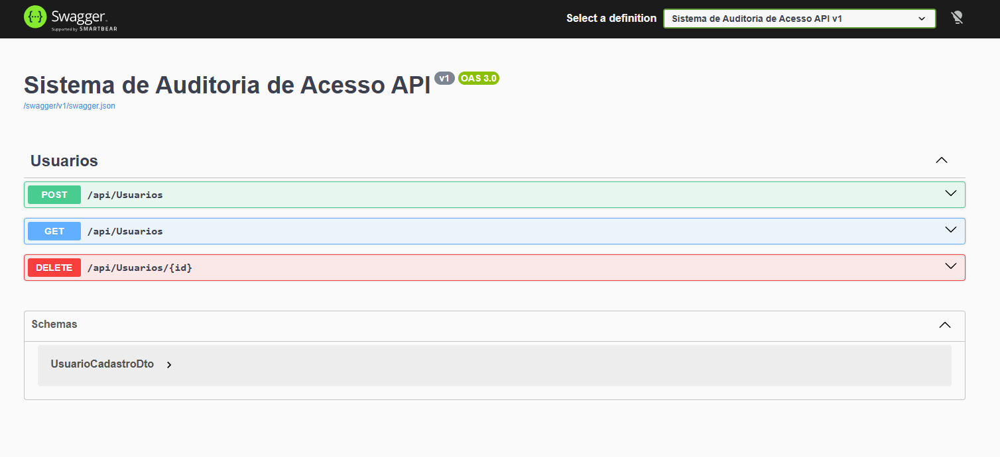

# Sistema de Auditoria de Acesso - Desafio Técnico

Este repositório contém a solução do Desafio Técnico para a vaga de **Desenvolvedor Full Stack**. O projeto consiste em um sistema de gerenciamento de usuários com registro automatizado de logs de auditoria de acesso.

## 1. Estrutura do Repositório (Monorepo)

> [!NOTE]  
> **Decisão de Design sobre a Estrutura do Repositório:**  
> Ambos os projetos (Back-end e Front-end) foram criados e unificados no **mesmo repositório Git**. Essa decisão foi tomada devido ao fato de a atividade demandada ser de pequeno porte, facilitando assim o versionamento, a orquestração do código, a simplicidade de setup e a entrega final do desafio técnico.

A estrutura de diretórios do projeto está organizada da seguinte forma:

```
AuditoriaAcesso/
├── AuditoriaAcesso.slnx             # Arquivo de solução moderno do .NET
├── Teste-Desenvolvedor/             # Instruções e regras de negócio do desafio
├── src/                             # Código-fonte do Back-end (.NET 10)
│   ├── AuditoriaAcesso.Api/          # Camada de Apresentação (ASP.NET Core Web API)
│   ├── AuditoriaAcesso.Aplication/   # Camada de Aplicação (Serviços e DTOs)
│   ├── AuditoriaAcesso.Domain/       # Camada de Domínio (Entidades e Regras de Negócio)
│   ├── AuditoriaAcesso.Infrastructure/ # Camada de Infraestrutura (EF Core, Repositórios)
│   └── AuditoriaAcesso.Tests/        # Testes Unitários (xUnit)
└── frontend/                        # Código-fonte do Front-end (React + Vite + TS)
    └── auditoria-frontend/          # Aplicação Web React
```

---

## 2. Tecnologias Utilizadas

### 2.1. Back-end
- **.NET 10** (ASP.NET Core Web API)
- **Entity Framework Core 9+**
- **Microsoft SQL Server**
- **BCrypt.Net-Next** (para Hashing seguro de senhas)
- **xUnit** + **Moq** (para Testes Unitários)
- **Swagger / OpenAPI** (documentação de endpoints)

### 2.2. Front-end
- **React 19**
- **TypeScript**
- **Vite**
- **Axios** (para requisições HTTP)
- **Vanilla CSS** (Estilização responsiva e customizada)

---

## 3. Arquitetura e Decisões de Design (DDD-Lite)

O back-end foi estruturado seguindo o padrão **DDD-Lite** (Domain-Driven Design simplificado) com a seguinte separação de responsabilidades:

1. **Domain**:
   - Contém as entidades de negócio (`Usuario`, `LogAcesso`).
   - Define a interface dos repositórios (`IUsuarioRepository`, `ILogAcessoRepository`).
   - Implementa regras de negócio críticas (como a verificação se um usuário `PodeSerExcluido()` com base em logs de acesso vinculados).
   - Sem dependências de frameworks externos para garantir a pureza das regras de negócio.
2. **Application**:
   - Contém os serviços de aplicação (`UsuarioAppService`) que orquestram os fluxos de dados.
   - Utiliza **DTOs** (`UsuarioCadastroDto`, `UsuarioDto`) para expor dados à API de forma segura, evitando a exposição direta das entidades do banco de dados.
3. **Infrastructure**:
   - Implementação de persistência usando o **Entity Framework Core e mapeamentos específicos** (`UsuarioMapping`, `LogAcessoMapping`).
   - Implementação dos repositórios de dados acessando o **SQL Server**.
   - Migrations do banco de dados.
4. **Api (Apresentação)**:
   - Exposição dos endpoints REST utilizando Controllers (`UsuariosController`).
   - Configurações globais de injeção de dependência, CORS e documentação automatizada com Swagger.

---

## 4. Como Executar o Back-end

### 4.1. Pré-requisitos
- SDK do **.NET 10** instalado.
- **Microsoft SQL Server** instalado e em execução (ou LocalDB).

### 4.2. Configurar a String de Conexão
No arquivo [appsettings.json](./src/AuditoriaAcesso.Api/appsettings.json), ajuste a string de conexão para apontar para a sua instância do SQL Server:

```json
"ConnectionStrings": {
  "DefaultConnection": "Server=SEU_SERVIDOR;Database=AuditoriaAcesso;Trusted_Connection=True;TrustServerCertificate=True;"
}
```

### 4.3. Aplicar as Migrations do Banco de Dados
A partir do diretório raiz (`AuditoriaAcesso/`), execute o comando para criar o banco de dados e aplicar as tabelas necessárias:

```bash
dotnet ef database update --project src/AuditoriaAcesso.Infrastructure --startup-project src/AuditoriaAcesso.Api
```

*Nota: Caso não tenha o `dotnet-ef` instalado globalmente, instale-o com:*
```bash
dotnet tool install --global dotnet-ef
```

### 4.4. Executar a API
Navegue até o diretório do projeto da API e inicie o servidor:

```bash
cd src/AuditoriaAcesso.Api
dotnet run
```

A API estará disponível por padrão em `https://localhost:7013` (ou no endereço indicado no terminal). Você pode acessar a interface do Swagger para interagir com a API em:
- [https://localhost:7013/index.html](https://localhost:7013/index.html) (Swagger UI)



---

## 5. Como Executar os Testes Unitários

Os testes unitários focam nas validações das regras de negócio (por exemplo, a restrição de exclusão de usuário caso este já tenha logs de acesso cadastrados).

Para executar os testes:

```bash
dotnet test src/AuditoriaAcesso.Tests
```

---

## 6. Como Executar o Front-end

Para instruções detalhadas de inicialização da interface React, consulte o [README do Front-end](./frontend/auditoria-frontend/README.md).
