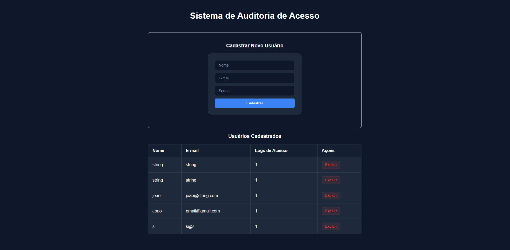

# Front-end - Sistema de Auditoria de Acesso

Este é o projeto front-end da aplicação **Sistema de Auditoria de Acesso**, desenvolvido como parte do desafio técnico de seleção. O projeto consiste em uma SPA (Single Page Application) moderna para gerenciar usuários e visualizar a contagem de logs de acesso de auditoria.

## 1. Contexto do Repositório (Monorepo)

> [!NOTE]  
> Este projeto foi unificado no mesmo repositório do back-end para facilitar a portabilidade do desafio, considerando que o escopo da atividade é enxuto. O projeto de Back-end completo pode ser visto na [raiz do repositório](../../README.md).

---

## 2. Tecnologias Utilizadas

- **React 19**
- **TypeScript**
- **Vite** (Build tool rápida e leve)
- **Axios** (Integração com API REST)
- **Vanilla CSS** (Estilização responsiva e customizada)

---

## 3. Funcionalidades Implementadas

1. **Listagem de Usuários**: Exibição em tabela de todos os usuários cadastrados com seu nome, e-mail e quantidade de logs de acesso gerados para fins de auditoria.
2. **Formulário de Cadastro**: Interface limpa para cadastrar novos usuários (Nome, E-mail e Senha) com validações básicas em tempo real (ex: verificação de preenchimento de todos os campos).
3. **Exclusão de Usuário**: Botão para remover um usuário selecionado, interagindo diretamente com o endpoint REST correspondente. O sistema impede a exclusão se o usuário já possuir logs registrados (validação proveniente da regra de negócio no backend).
4. **Atualização Reativa**: Atualização imediata dos dados exibidos na tabela após cadastros ou exclusões bem-sucedidas.

---

## 4. Como Executar o Front-end

### 4.1. Pré-requisitos
- **Node.js** instalado (versão 18 ou superior recomendada).
- Gerenciador de pacotes **npm** (ou yarn).

### 4.2. Instalar as Dependências
Navegue até a pasta deste projeto e execute a instalação dos pacotes:

```bash
cd frontend/auditoria-frontend
npm install
```

### 4.3. Configurar a URL da API
No arquivo [api.ts](./src/services/api.ts), certifique-se de que a `baseURL` aponta para o endereço em que a sua API .NET está rodando:

```typescript
export const api = axios.create({
    baseURL: 'https://localhost:7013/api' // Ajuste se necessário
});
```

### 4.4. Rodar o Servidor de Desenvolvimento
Inicie o projeto localmente:

```bash
npm run dev
```

O projeto estará acessível pelo navegador no endereço padrão informado pelo Vite (geralmente [http://localhost:5173/](http://localhost:5173/)).



---

## 5. Estrutura do Código

```
auditoria-frontend/
├── src/
│   ├── assets/         # Recursos estáticos
│   ├── components/     # Componentes reutilizáveis
│   │   ├── UsuarioForm.tsx    # Formulário de cadastro de usuário
│   │   └── UsuarioTabela.tsx  # Tabela de listagem e exclusão
│   ├── services/       # Cliente de integração HTTP (Axios)
│   │   └── api.ts
│   ├── App.css         # Estilos globais/aplicação
│   ├── App.tsx         # Componente raiz que orquestra o estado
│   ├── index.css       # Estilos básicos
│   └── main.tsx        # Ponto de entrada do React
├── package.json
└── vite.config.ts
```
